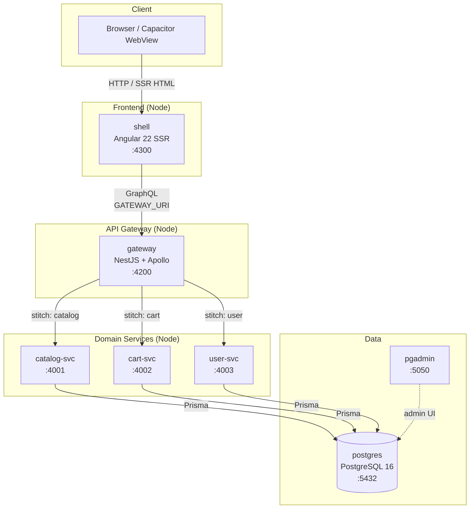

# Multi-Framework Micro-Frontend Reference Architecture

A generic, runnable reference architecture that composes **Web Components** built in
**three different frameworks — Angular, React, and Vue** — into a single host shell,
with **shell-level SSR + per-MF hydration** for SEO and first-paint performance, backed
by **NestJS micro-services** over **GraphQL**, and wrapped for **hybrid mobile** via
**Capacitor**. The sample domain is e-commerce (catalog, cart, user).

> **This workspace is the source of truth for the whole platform.** It contains the
> 12 independently-versioned repositories (each with its own CI/CD pipeline), the
> original Nx + pnpm monorepo kept as a **read-only reference** (`microfrontend/`),
> and the cross-repo orchestration tooling.

---

## Table of contents

- [Architecture solution](#architecture-solution)
- [Key decisions](#key-decisions)
- [Repository map](#repository-map)
- [Docker topography](#docker-topography)
- [How to run](#how-to-run)
- [Build history (phases)](#build-history-phases)
- [Glossary & repository documentation index](#glossary--repository-documentation-index)

---

## Architecture solution

The platform is split into three horizontal layers. Each layer is independently
versioned, built, and published, and the dependency direction is strictly
**top-down** (a layer may only depend on the layer(s) below it).

```
┌─────────────────────────────────────────────────────────────────────────────┐
│  CLIENT LAYER                                                                │
│  shell (Angular 22, SSR)  ·  mobile (Capacitor wrapper)                      │
│  composes the 3 MFs as <mf-catalog> <mf-cart> <mf-user>                     │
├─────────────────────────────────────────────────────────────────────────────┤
│  MICRO-FRONTEND LAYER  (Web Components, one per framework)                   │
│  catalog (Angular 22)   ·   cart (React 19)   ·   user (Vue 3)              │
├─────────────────────────────────────────────────────────────────────────────┤
│  SHARED LAYER  (framework-agnostic, published to GitHub Packages)            │
│  @jrumandal/contracts · event-bus · design-tokens · bridge                  │
└─────────────────────────────────────────────────────────────────────────────┘
                                   ▲
                                   │ GraphQL (single /graphql endpoint)
┌─────────────────────────────────────────────────────────────────────────────┐
│  API GATEWAY  (NestJS + Apollo Server 4, schema stitching)                  │
├─────────────────────────────────────────────────────────────────────────────┤
│  DOMAIN SERVICES  (NestJS + Prisma, one per bounded context)                │
│  catalog-svc (4001)   ·   cart-svc (4002)   ·   user-svc (4003)            │
├─────────────────────────────────────────────────────────────────────────────┤
│  DATA LAYER                                                                  │
│  PostgreSQL 16  ·  Prisma ORM  ·  pgAdmin (admin UI)                        │
└─────────────────────────────────────────────────────────────────────────────┘
```

### The integration contract: Web Components

The micro-frontends are exposed to the shell as **custom elements**
(`<mf-catalog>`, `<mf-cart>`, `<mf-user>`) using **light DOM** by default and
**custom events** for communication. This is deliberately framework-agnostic:

- It works identically in a browser, in the **Capacitor WebView**, and in any
  future shell framework.
- No framework is required to *consume* an MF — only to *build* one.
- Cross-MF state is decoupled through a **typed event bus** + a **shell-level
  NgRx store** (the single source of truth). There are **no direct cross-MF
  imports**.

### The API contract: GraphQL

- The **gateway** is the single GraphQL entry point. It **stitches** the three
  domain services into one schema so every client talks to one `/graphql`
  endpoint instead of three.
- The three services are **plain (non-federation) GraphQL servers**; the gateway
  uses **introspection-based stitching** (`@graphql-tools/stitch` + `wrap`)
  rather than Apollo Federation.
- **Code-generated TypeScript types** flow from the GraphQL SDL into the
  `@jrumandal/contracts` package, shared by clients and services.
- **OpenAPI** is retained for admin/REST fallback and Swagger UI (`/api-docs`).

### SSR: shell-level + per-MF hydration

- The **shell's Angular SSR server** calls each MF's `ssr.render(props)` to
  obtain an HTML string, composites it into the page, and sends it before first
  paint.
- On the client, each MF **hydrates** its own markup (React/Vue use light-DOM
  hydration; Angular uses `createApplication`).
- The shell owns a **shared `ApolloClient` singleton** that is injected into
  every MF after hydration.

### State management: shell-level NgRx store

- The **shell is the composition root** and the **single source of truth** for
  cross-MF state. The three MFs are plain Web Components (Angular, React, Vue)
  with no shared DI container, so the store lives in the shell rather than
  inside each MF.
- The store holds `catalog`, `cart`, `user`, and `navigation` slices. Route
  components dispatch `load` actions; **`ShellEffects`** fetch from the gateway
  via the shared `ApolloClient` (the cart effect first ensures the `user` slice
  is loaded, since the cart is fetched per user); and each navigation **pushes
  the store state into the MF element's properties** so the MF re-renders.
- **`@ngrx/router-store`** records every completed navigation into the
  `navigation` slice (`current` plus a bounded `history`), giving a **backtrace**
  of the session.
- This keeps the MFs **self-contained** (they render whatever props they are
  given) and preserves the "no direct cross-MF imports" rule.

### Mobile: Capacitor

- `mobile` is a **thin wrapper** with no app code of its own. It packages the
  shell's production web build into a native Android/iOS shell.
- A **bridge adapter** exposes native plugins (e.g. camera) with a **Web-API
  fallback**, so the same MF code runs in the browser and in the native app.

### Dependency direction

```
shell  →  mf/*  →  shared/*
mf/*   →  shared/contracts  →  graphql
server/*  →  server-shared  →  prisma
```

A layer never depends on a layer above it. `shared` and `server-shared` are the
two **foundations** of the frontend and backend dependency graphs respectively —
they are built and published first.

---

## Key decisions

| # | Decision | Rationale |
|---|----------|-----------|
| 1 | **Web Components** as the integration contract | Framework-agnostic; works in Capacitor WebView + any shell. |
| 2 | **Light-DOM hydration** for React/Vue MFs | Simpler SSR/hydration story than shadow DOM; styles stay in the shell. |
| 3 | **Decoupled cross-MF state** via typed event bus + **shell-level NgRx store** | No direct cross-MF imports; shell is the single source of truth; navigation backtrace. |
| 4 | **GraphQL** (introspection stitching) as the API contract | Single endpoint; codegen types; OpenAPI retained for REST fallback. |
| 5 | **Shell-level SSR + per-MF hydration** | SEO + first-paint perf without forcing every MF to be SSR-capable. |
| 6 | **PostgreSQL + Prisma ORM** | One schema, typed client, migrations; shared via `server-shared`. |
| 7 | **Capacitor** over Cordova | Modern, web-first, single codebase for Android/iOS. |
| 8 | **12 independent repos** (split from the monorepo) | Independent versioning + CI/CD; cross-repo orchestration for releases. |

**Scope explicitly excluded** (out of bounds for this reference): real auth/IdP,
payment/checkout, i18n, feature-flags, observability/APM, production infra
(K8s/CDN), a full e2e suite, and cross-service DB transactions.

---

## Repository map

Twelve independently-versioned repositories, each with its own CI/CD pipeline.
All are published under the **`@jrumandal`** npm scope (GitHub Packages).

| Repo | Package | Role | Framework / Stack |
|------|---------|------|-------------------|
| [`shared`](./shared) | `@jrumandal/{contracts,event-bus,design-tokens,bridge}` | Frontend foundation (4 packages) | TS, framework-agnostic |
| [`server-shared`](./server-shared) | `@jrumandal/shared` | Backend foundation (NestJS building blocks + Prisma) | NestJS 11, Prisma 6 |
| [`catalog`](./catalog) | `@jrumandal/catalog` | Catalog MF (`<mf-catalog>`) | Angular 22 |
| [`cart`](./cart) | `@jrumandal/cart` | Cart MF (`<mf-cart>`) | React 19, Vite 6 |
| [`user`](./user) | `@jrumandal/user` | User MF (`<mf-user>`) | Vue 3.5 |
| [`shell`](./shell) | `@jrumandal/shell` | Host app, SSR composition | Angular 22, `@angular/ssr` |
| [`gateway`](./gateway) | `@jrumandal/gateway` | GraphQL gateway (schema stitching) | NestJS 11, Apollo Server 4 |
| [`catalog-svc`](./catalog-svc) | `@jrumandal/catalog-svc` | Catalog domain service | NestJS 11, Prisma |
| [`cart-svc`](./cart-svc) | `@jrumandal/cart-svc` | Cart domain service | NestJS 11, Prisma |
| [`user-svc`](./user-svc) | `@jrumandal/user-svc` | User domain service | NestJS 11, Prisma |
| [`mobile`](./mobile) | `@jrumandal/mobile` | Capacitor hybrid wrapper | Capacitor |
| [`mf-orchestrator`](./mf-orchestrator) | `@jrumandal/mf-orchestrator` | Cross-repo CI/CD coordination (private) | Node scripts |

> The original **Nx + pnpm monorepo** is preserved at [`microfrontend/`](./microfrontend)
> as a **read-only reference**. It is the source each repo was faithfully ported
> from and is **excluded** from all edits, builds, and CI.

---

## Docker topography

The full platform runs as a **7-service Docker Compose stack**. The dependency
chain is `shell → gateway → {catalog-svc, cart-svc, user-svc} → postgres`, with
`pgadmin` as the database admin UI.



### Service table

| Service | Image | Container | Port | Depends on | Healthcheck |
|---------|-------|-----------|------|------------|-------------|
| `postgres` | `postgres:16-alpine` | `mf-postgres` | `5432` | — | `pg_isready` |
| `pgadmin` | `dpage/pgadmin4:8` | `mf-pgadmin` | `5050` | `postgres` | — |
| `catalog-svc` | `mf/catalog-svc:latest` | `mf-catalog-svc-1` | `4001` | `postgres` (healthy) | `GET /health` |
| `cart-svc` | `mf/cart-svc:latest` | `mf-cart-svc-1` | `4002` | `postgres` (healthy) | `GET /health` |
| `user-svc` | `mf/user-svc:latest` | `mf-user-svc-1` | `4003` | `postgres` (healthy) | `GET /health` |
| `gateway` | `mf/gateway:latest` | `mf-gateway-1` | `4200` | all 3 svcs (healthy) | TCP `:4200` |
| `shell` | `mf/shell:latest` | `mf-shell-1` | `4300` | `gateway` (healthy) | `GET /catalog` |

### Data flow

1. **Browser / Capacitor** requests a page from **shell** (`:4300`).
2. **shell** (Angular SSR) renders the page and, for each MF, calls the MF's
   `ssr.render(props)` to obtain markup, compositing it before first paint.
3. For data, the shell's shared **ApolloClient** calls the **gateway**
   (`:4200/graphql`).
4. **gateway** stitches the request across **catalog-svc** (`:4001`),
   **cart-svc** (`:4002`), and **user-svc** (`:4003`).
5. Each service reads/writes **PostgreSQL** (`:5432`) via **Prisma**.
6. **pgAdmin** (`:5050`) is the human-facing admin UI for the database.

### Verified state

All 7 services were verified **healthy** and reachable over HTTP:

- `gateway` `/api-docs` → `200`
- `shell` `/` → `302` (SPA redirect, expected)
- `catalog-svc` / `cart-svc` / `user-svc` `/health` → `200`

---

## How to run

### Prerequisites

- **Node 22 LTS**, **pnpm 11.24.0**
- **Docker Desktop** (for the data + service stack)
- A GitHub **PAT** with `repo`, `workflow`, `write:packages` scopes (for publishing)

### 1. Start the database

```bash
cd /mnt/d/workspace
docker compose up -d          # postgres (:5432) + pgadmin (:5050)
```

Connection string (mirrored in each service's `.env`):

```
postgresql://mf:mf@localhost:5432/microfrontend?schema=public
```

### 2. Build & publish the foundations

The two foundations must be built and published **before** their dependents:

```bash
# Frontend foundation (4 packages)
cd shared && pnpm install && pnpm build && node scripts/publish.mjs

# Backend foundation
cd ../server-shared && pnpm install && pnpm build && node scripts/publish.mjs
```

### 3. Build the micro-frontends + shell

```bash
# Each MF (cart, catalog, user) — build + publish
# Then the shell, which bundles all three
cd shell && pnpm install && pnpm build
```

### 4. Build the services + gateway

```bash
# Each service (catalog-svc, cart-svc, user-svc) — build
# Then the gateway, which stitches them
cd gateway && pnpm install && pnpm build
```

### 5. Run the full stack

```bash
docker compose -f <full-stack-compose> up -d
# shell :4300  ·  gateway :4200  ·  catalog-svc :4001
# cart-svc :4002  ·  user-svc :4003  ·  postgres :5432  ·  pgadmin :5050
```

### 6. Mobile (Capacitor)

```bash
cd mobile
pnpm build-web        # syncs the shell's web build into web/
npx cap add android   # or: npx cap add ios
npx cap sync && npx cap build
```

> **Cross-repo releases** are coordinated by [`mf-orchestrator`](./mf-orchestrator),
> which publishes the 11 sibling repositories in **topological order**
> (dependencies first).

---

## Build history (phases)

The platform was built in phases, tracked in [`STEPS.md`](./STEPS.md). All phases
are complete.

| Phase | Scope | Status |
|-------|-------|--------|
| **0** | Monorepo scaffolding (Nx + pnpm, plugins, tsconfig paths) | ✅ |
| **1** | Shared contracts (OpenAPI, GraphQL SDL, contracts lib + codegen, event-bus, design-tokens) | ✅ |
| **1.5** | Database layer (Prisma schema, docker-compose PostgreSQL 16 + pgAdmin, `@shared/db`, idempotent seed) | ✅ |
| **2** | Micro-Frontends as Web Components (Angular catalog, React cart, Vue user; SSR entry + hydrate + register) | ✅ |
| **3** | Shell (Angular SSR) + composition (register 3 custom elements, routes, SSR composition, shared ApolloClient) | ✅ |
| **4** | NestJS micro-services + gateway (catalog-svc, cart-svc, user-svc, server/shared, api-gateway stitching, e2e) | ✅ |
| **5** | Capacitor hybrid mobile (apps/mobile, sync shell build, bridge adapter + camera demo) | ✅ |
| **6** | DX, docs, CI (root README, Nx aggregate targets, GitHub Actions CI, final e2e verification) | ✅ |
| **A** | **Multi-repo split (frontend):** shared, cart, catalog, user, shell, root glue, Tailwind v4 + design-tokens | ✅ |
| **B** | **Per-repo CI/CD + cross-repo orchestration:** server-shared, gateway, 3 services, mobile, mf-orchestrator, push + verify 12/12 green, README consistency | ✅ |

**Notable blockers resolved:** Vue SSR async (`renderToString` returns a
Promise), Angular `NG0201` ComponentFactoryResolver (fixed with
`createApplication`), shared-lib externalization (`peerDependencies` +
`paths → dist`), pnpm 11 `allowBuilds` approval, and GitHub Packages
`_authToken` auth + auto-bump publishing.

---

## Glossary & repository documentation index

Each repository ships its own `README.md`. The table below is a **glossary** of
the platform's components with a one-line summary and a link to the full
documentation.

### Frontend

| Component | Package | One-line summary | Documentation |
|-----------|---------|------------------|---------------|
| **shared** | `@jrumandal/{contracts,event-bus,design-tokens,bridge}` | Framework-agnostic foundation: typed API contracts, cross-MF event bus, design tokens, and web-component bridge. | [README](./shared/README.md) · [github.com/jrumandal/shared](https://github.com/jrumandal/shared) |
| **catalog** | `@jrumandal/catalog` | Angular 22 catalog MF (`<mf-catalog>`): product grid, category/price filtering, search, scan-product. | [README](./catalog/README.md) · [github.com/jrumandal/catalog](https://github.com/jrumandal/catalog) |
| **cart** | `@jrumandal/cart` | React 19 cart MF (`<mf-cart>`), Vite 6 IIFE bundle published to GitHub Packages. | [README](./cart/README.md) · [github.com/jrumandal/cart](https://github.com/jrumandal/cart) |
| **user** | `@jrumandal/user` | Vue 3 user MF (`<mf-user>`): signed-in profile or sign-in form. | [README](./user/README.md) · [github.com/jrumandal/user](https://github.com/jrumandal/user) |
| **shell** | `@jrumandal/shell` | Angular 22 SSR host app that composes the 3 MFs, owns routing + shared ApolloClient. | [README](./shell/README.md) · [github.com/jrumandal/shell](https://github.com/jrumandal/shell) |
| **mobile** | `@jrumandal/mobile` | Capacitor hybrid wrapper that packages the shell's web build into native Android/iOS. | [README](./mobile/README.md) · [github.com/jrumandal/mobile](https://github.com/jrumandal/mobile) |

### Backend

| Component | Package | One-line summary | Documentation |
|-----------|---------|------------------|---------------|
| **server-shared** | `@jrumandal/shared` | Backend foundation: typed env config, Prisma lifecycle, health checks, logging, error handling, Prisma schema. | [README](./server-shared/README.md) · [github.com/jrumandal/server-shared](https://github.com/jrumandal/server-shared) |
| **gateway** | `@jrumandal/gateway` | GraphQL gateway that stitches the 3 domain services into one `/graphql` endpoint (+ OpenAPI, `/health`). | [README](./gateway/README.md) · [github.com/jrumandal/gateway](https://github.com/jrumandal/gateway) |
| **catalog-svc** | `@jrumandal/catalog-svc` | NestJS service owning the catalog domain (products, categories), Prisma-backed. | [README](./catalog-svc/README.md) · [github.com/jrumandal/catalog-svc](https://github.com/jrumandal/catalog-svc) |
| **cart-svc** | `@jrumandal/cart-svc` | NestJS service owning the cart domain (carts + line items), Prisma-backed. | [README](./cart-svc/README.md) · [github.com/jrumandal/cart-svc](https://github.com/jrumandal/cart-svc) |
| **user-svc** | `@jrumandal/user-svc` | NestJS service owning the user domain (accounts, sessions, orders), Prisma-backed. | [README](./user-svc/README.md) · [github.com/jrumandal/user-svc](https://github.com/jrumandal/user-svc) |

### Meta

| Component | Package | One-line summary | Documentation |
|-----------|---------|------------------|---------------|
| **mf-orchestrator** | `@jrumandal/mf-orchestrator` | Private meta-repo: repo registry + Node scripts that coordinate cross-repo releases in topological order. | [README](./mf-orchestrator/README.md) · [github.com/jrumandal/mf-orchestrator](https://github.com/jrumandal/mf-orchestrator) |

### Shared sub-packages (inside the `shared` repo)

The `shared` repo publishes four packages, each documented in the
[`shared` README](./shared/README.md):

| Package | Purpose |
|---------|---------|
| `@jrumandal/contracts` | Typed API contracts (OpenAPI + GraphQL) shared by clients and services. |
| `@jrumandal/event-bus` | Framework-agnostic event bus for cross-MF communication. |
| `@jrumandal/design-tokens` | Design tokens: typed `Tokens` const + `cssVar()` helper, and `tokens.css` (CSS variables + dark theme). |
| `@jrumandal/bridge` | Web-component bridge / host utilities used by the shell and MFs. |

---

## Reference

- **Architecture plan:** [`plan.md`](./plan.md)
- **Build history / step tracker:** [`STEPS.md`](./STEPS.md)
- **Original monorepo (read-only reference):** [`microfrontend/`](./microfrontend)
